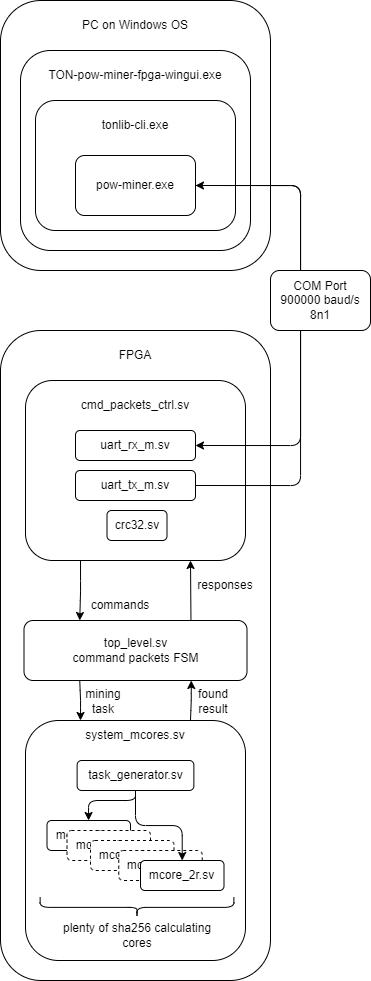

# TON-pow-miner-fpga

Contact with developers group
e-mail: aifashion@yandex.ru

TON wallet address for donations:
EQAvRnuckR42aEE29_WCDCTOwEci1ZKo8a5ul4ncYWaqxA2q

Video with CLI tools and GUI tools demonstration:
https://youtu.be/6jhKerembEo

Video with hardware demonstration:
https://youtu.be/LwFCbMIoDbs

RTL models and digital design overview:
https://youtu.be/UAWZrs7xN-E

This repository contains:
1. Verilog/SystemVerilog RTL models of TON Coin miner (you can synthesize for different FPGA's or ASIC's);
2. Project with BitStream for Xilinx Kintex-7 325T FPGA;
3. CLI tools for Windows OS. This tools receives from TON Coin GIVER tasks and sends via UART/COM-port interface this tasks to FPGA miner;
4. Windows GUI for automatic mining process where you can create several mining processes for several FPGA's.

FPGA miner architecture:  

